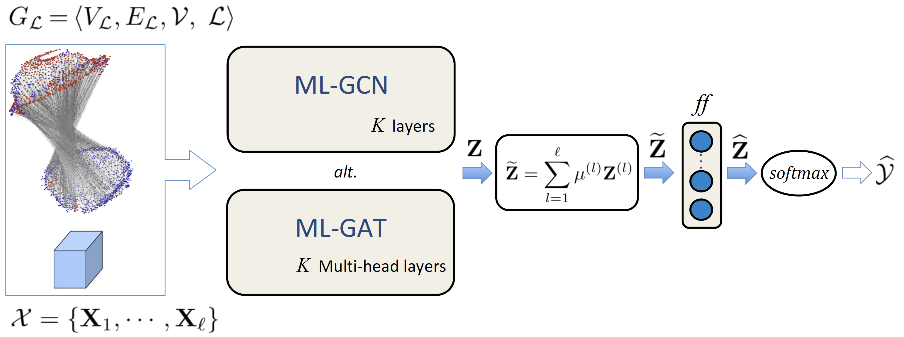

# Source code of *"Graph convolutional and attention models for entity classification in multilayer networks"*

>The aim of this work is to generalize GNNs approaches by proposing a GNN framework for representation learning and semi-supervised classification in  multilayer networks with attributed entities, 
and arbitrary number of layers and intra-layer and inter-layer connections between nodes.  
We instantiated  our framework with two new formulations of [GAT](https://arxiv.org/abs/1710.10903) and [GCN](https://arxiv.org/abs/1609.02907)
models, namely **ML-GCN** and **ML-GAT**, specifically devised for  general, attributed multilayer networks. 

```
Zangari, L., Interdonato, R., Calió, A. et al. 
Graph convolutional and attention models for entity classification in multilayer networks.
Appl Netw Sci 6, 87 (2021). https://doi.org/10.1007/s41109-021-00420-4
```

The figure below illustrates the main components of our framework.



## Input Data

Crete a new folder named *\<dataset_name\>*, containing the following files:
1. A file named *meta_info.txt*, containing information about the input network, such as:
    * **N**, the number of entities.
    * **L**, the number of layers.
    * **E**, whether the multilayer graph is directed (DIRECTED) or undirected (UNDIRECTED).
    * **TYPE**, indicating the type of the input multilayer network,
      i.e., whether it's a multiplex network (MPX) or a general multilayer network (GML).

      
   For example, given an undirected multiplex graph with 20 entities, 3 layers, 
   the **meta_info.txt** is:

```python

   N  L     E        TYPE
   
   20 3  UNDIRECTED   MPX
```
2. A file named *nodes.txt*: a column vector indicating the numerical labels of the entities where 
the  generic i-th row must contains the label associated with the i-th entity.
 
3. A file named *net.edges*, containing the input multilayer graph edge information.
     * In case the network is multiplex (MPX) the format must be **\<layer source-node dest-node\>**.
     * In the case of a general multilayer network (GML) the format must be **\<source-layer source-node dest-layer dest-node\>**.
   
   Please note that **node identifiers** must be numeric, progressive and starting from 0. The **layers identifiers** must start with 1 and be progressive.
   

4. The features matrix for the entities, which must be in csv format and with comma-separated values, if present.

Note that the files described in point 1,2 and 3 are mandatory.

## Models execution
To train the models, run the *train.py* script as follows:
```python

   python training/train.py --data "root_dir" --dataset "dataset_name"

```  
which will run the network named "dataset_name"
inside the directory "root_dir". 
To run with input features:
```python

   python training/train.py --data "root_dir" --dataset "dataset_name" --feat-distribution='features.csv'

```

For the list of all hyper-parameters see the utils/params.py script, please.

## Requirements

The required libraries for code execution are listed in *requirements.txt*.
